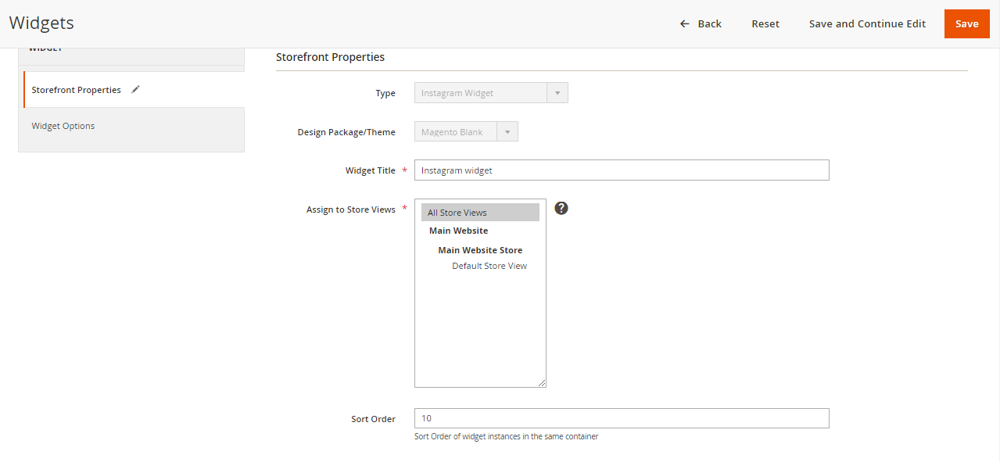

# M2Commerce: Magento 2 Instagram Widget

## Description
This extension helps merchants integrate their online store with their Instagram.
Instagram is one of the most engaged social media apps in the world. And of course you can use instagram images to increase traffic to your website.

- Easy-to-customize admin panel
- Enable / Disable with one click
- Integrate your Instagram account into the website quickly
- Select the number of instagram images displayed on the website
- Customize instagram slider effects
- Respond to devices. Customizable dimensions in admin panel
- Add unlimited instagram widget
- Open source compatible

## Configuration

There are several configuration options for this extension, which can be found at **STORES > Configuration > Commerce Enterprise > Instagram Widget**.

After setting up configurations choose `content->wigdet` then add widget




## Installation
### Magento® Marketplace

This extension will also be available on the Magento® Marketplace when approved.

1. Go to Magento® 2 root folder
2. Require/Download this extension:

   Enter following commands to install extension.

   ```
   composer require m2commerce/instagram-widget"
   ```

   Wait while composer is updated.

   #### OR

   You can also download code from this repo under Magento® 2 following directory:

    ```
    app/code/M2Commerce/InstagramWidget
    ```    

3. Enter following commands to enable the module:

   ```
   php bin/magento module:enable M2Commerce_InstagramWidget
   php bin/magento setup:upgrade
   php bin/magento setup:di:compile
   php bin/magento cache:clean
   php bin/magento cache:flush
   ```

4. If Magento® is running in production mode, deploy static content:

   ```
   php bin/magento setup:static-content:deploy
   ```
